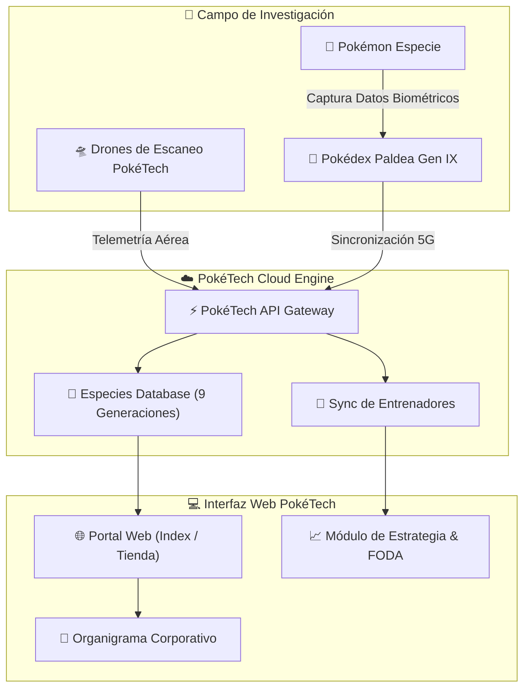

# 🔴⚡ PokéTech Research & Development Corp.
> *Innovación de Vanguardia para la Investigación y Registro de Especies Pokémon.*


---

## 🌟 ¿Qué es PokéTech?

**PokéTech** es una corporación líder en investigación biológica y desarrollo tecnológico dedicada al diseño, fabricación y distribución de dispositivos **Pokédex de nueva generación**. 

Presente en las **9 regiones reconocidas** (desde Kanto hasta Paldea), PokéTech combina sensores cuánticos de escaneo, inteligencia de campo mediante drones autónomos y una red de sincronización en tiempo real para ofrecer a Entrenadores e Investigadores la herramienta definitiva de avistamiento y estudio de Pokémon.

> [!NOTE]
> PokéTech no solo construye hardware; desarrolla un ecosistema completo de consulta, estrategia de combate, métricas de conservación y certificación de estándares éticos en el mundo Pokémon.

---

## ✨ ¿Por qué y cómo es "bonito"?

PokéTech destaca por una **experiencia visual cautivadora y de alta fidelidad** que enamora a primera vista. Su belleza no es solo superficial; radica en la armonía entre el diseño visual y la arquitectura técnica.

### 🎨 1. Estética Rediseñada con Identidad Poké-Tech
- **Paleta de Colores Icónica & Armónica:**
  - `🔴 #E3350D` — *Rotom Red / Crimson Pasión* (Energía y dinamismo).
  - `🔵 #0075BE` — *Ultra Ball Blue* (Tecnología y precisión).
  - `⚫ #111827` — *Obsidian Dark* (Elegancia moderna y contraste).
  - `⚪ #FFFFFF` — *Pure White* (Claridad visual).
- **Tipografía Espectacular:** Combinación de **Fredoka** (titulares amigables y redondeados) con **Rubik** (texto de lectura ágil y claro).

### ⚡ 2. Ilustraciones SVG Puras y Micro-animaciones
- Sin recursos pesados ni imágenes pixeladas: Todos los componentes visuales (como el escáner de Pokédex y la lente de haz óptico) están renderizados directamente mediante **SVG nativo**.
- **Radar con haz giratorio y escaneo activo:** Efectos de luz suaves en CSS que transmiten dinamismo en vivo.

### 📐 3. Layouts Limpios y Tarjetas Interactivas
- **Efectos Neumórficos y Sombras Suaves:** Elevación tridimensional limpia para dar la sensación de manipular un dispositivo físico.
- **Micro-interacciones en Hover:** Respuesta táctil inmediata al interactuar con productos, módulos de estrategia y departamentos.

---

## 📊 Comparativa de Generaciones Pokédex

| Generación | Región Principal | Pantalla / Interfaz | Conectividad | Escáner Biométrico | Batería |
| :--- | :--- | :--- | :--- | :--- | :--- |
| **Gen I** | Kanto | Monocromática LCD | Cable Link | Lente Monocular | Pila 4x AA |
| **Gen III** | Hoenn | Color Dual-Screen | Wireless Adapter | Escáner Infrarrojo | Ion de Litio |
| **Gen IV** | Sinnoh | Touchscreen Poketch | Wi-Fi Nintendo WFC | Bio-Radar de Huella | Carga Magnética |
| **Gen VI** | Kalos | Holográfica Plegable | Red Holomisor 3G | Lidar de Movimiento | Núcleo Fotovoltaico |
| **Gen IX** | Paldea (PokéTech) | Retina Oled Bezelless | PokéTech Cloud 5G | Escáner Térmico Téra | Carga Inductiva Solar |

---

## 🛠️ Ecosistema y Flujo de Trabajo (Diagrama)



---

## 📁 Estructura del Proyecto

El proyecto PokéTech está estructurado con máxima modularidad y código limpio:

```
Pok-Tech/
├── 📄 index.html           # Landing page principal con Hero interactivo y métricas
├── 📁 components/          # Componentes reutilizables (Header, Footer, Navbar)
│   └── 📄 navbar.html
├── 📁 css/                 # Hojas de estilo organizadas
│   ├── 📄 variables.css    # Variables CSS globales (colores, fuentes, sombras)
│   └── 📄 main.css         # Estilos globales y layouts responsivos
├── 📁 js/                  # Lógica interactiva
├── 📁 assets/              # Logos, SVG e iconografía oficial
└── 📁 pages/               # Páginas secundarias del portal
    ├── 📄 tienda.html      # Catálogo de las 9 generaciones Pokédex
    ├── 📄 estrategia.html  # Misión, visión, valores y análisis FODA
    ├── 📄 organizacion.html# Organigrama corporativo y equipo directivo
    ├── 📄 trabajo.html     # Cultura laboral y bolsa de trabajo
    └── 📄 compromiso.html  # Calidad, sostenibilidad y certificaciones
```

---

## 🚀 Cómo Ejecutar el Proyecto Localmente

1. **Clonar / Copiar el repositorio** dentro de la carpeta del servidor local (ej. `C:/xampp/htdocs/Pok-Tech`).
2. **Iniciar servidor web:**
   - Usando **XAMPP**: Inicia el servicio de Apache e ingresa a `http://localhost/Pok-Tech/`.
   - Usando **Live Server** (VS Code / IDE): Haz clic secundario en `index.html` y selecciona *Open with Live Server*.
   - Usando **Node.js**:
     ```bash
     npx http-server -p 8080
     ```
3. ¡Disfruta navegando por el universo PokéTech!

---

> [!IMPORTANT]
> **Certificación de Calidad:** Desarrollado bajo los estándares de PokéTech R&D Corp. Todos los componentes cumplen con la normativa de conservación y ética Pokémon 2026.
